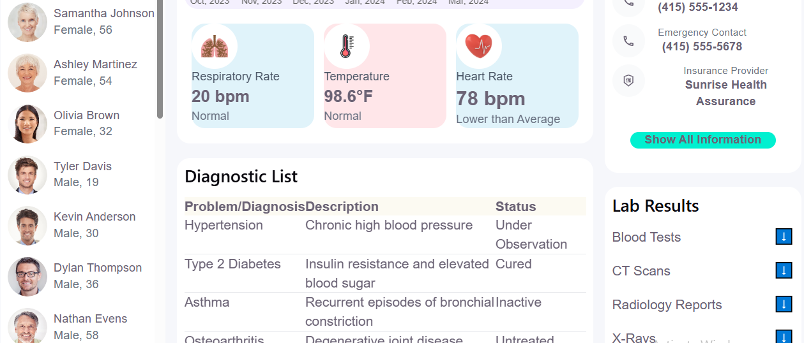

# Tech Care Dashboard

A healthcare dashboard built with React and Vite, based on a design provided by Coalition Technologies (Adobe XD).

## Overview

The dashboard displays patient data including diagnosis history, blood pressure charts, lab results, and vitals. The focus was on matching the design closely while keeping components reusable and the structure simple.

## Tech Stack

React, Vite, JavaScript (ES6+), CSS3

## Project Structure

```text
src/
 ├── assets/
 ├── components/
 │   ├── BloodPressureCharts/
 │   ├── DiagnosisHistory/
 │   ├── DiagnosticList/
 │   ├── Header/
 │   ├── LabResults/
 │   ├── PatientProfile/
 │   ├── PatientsList/
 │   └── VitalCards/
 ├── services/
 ├── App.jsx
 ├── App.css
 └── main.jsx
```

## Getting Started

```bash
git clone https://github.com/gkaveri/tech-care-dashboard.git
cd tech-care-dashboard
npm install
npm run dev
```

## Screenshots




## Author

G. Kaveri — [GitHub](https://github.com/gkaveri)